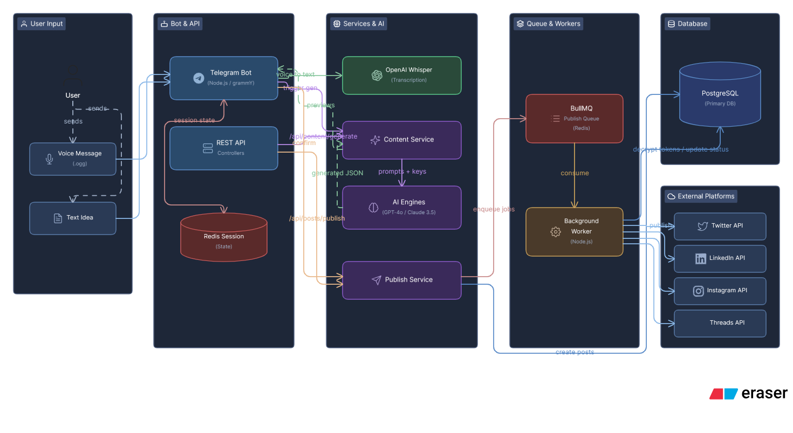

# Architecture & Data Flow

## 1. End-to-End Post Flow

The journey of a post in Postly follows these steps:

1.  **Ingestion (Telegram Bot):** User interacts with the bot. Commands like `/post` trigger a stateful conversation. The state is stored in **Redis** keyed by the chat ID.
2.  **Voice Processing:** If the user sends a voice message, the bot downloads the `.ogg` file, converts it to a buffer, and sends it to **OpenAI Whisper** via the `transcribe_voice` utility.
3.  **AI Generation:** The raw idea and metadata (type, tone, platforms) are sent to the `content.service`.
    *   The service builds a platform-specific system prompt.
    *   It calls either OpenAI (GPT-4o) or Anthropic (Claude 3.5).
    *   It uses the user's encrypted API keys if available, otherwise falls back to the system's keys.
4.  **Confirmation & Persistence:** The user previews the content and confirms.
    *   The `publish.service` creates a parent `posts` record and multiple child `platform_posts` records.
    *   It then adds one job per platform to the **BullMQ** `publish` queue.
5.  **Execution (Worker):** The `worker.ts` process consumes jobs.
    *   It calls the specific platform handler (e.g., `twitter.handler.ts`).
    *   It decrypts the user's social tokens at runtime.
    *   On success/failure, it updates the `platform_posts` status and recomputes the parent `posts` status.

## 2. State Management

- **Conversations:** Managed manually in Redis using `get_session` and `save_session`.
  - Key: `bot:session:<chat_id>`
  - TTL: 1800 seconds (30 minutes).
  - Every user interaction resets the TTL, satisfying the "30 min of inactivity" requirement.
- **Linking Flow:** A separate Redis namespace `bot:link:<chat_id>` is used for the one-time email/password account linking process.

## 3. Failure Handling

- **Partial Failures:** If Twitter succeeds but LinkedIn fails, the system marks the post as `failed` (overall) but tracks the success of the individual platform post.
- **Exponential Backoff:** BullMQ is configured with a custom backoff: `Math.pow(5, attemptsMade - 1) * 1000`. 
  - Attempt 1: 1s
  - Attempt 2: 5s
  - Attempt 3: 25s
- **Decoupling:** If the AI service or a platform API is down, the job remains in the queue or is marked as `failed`, allowing the user to `retry` specifically from the dashboard later.
